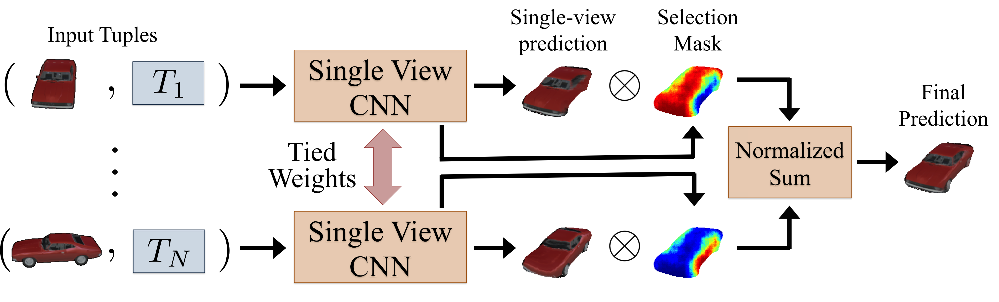
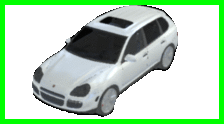
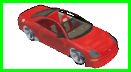
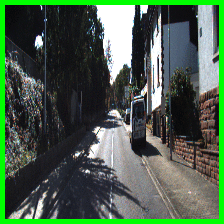
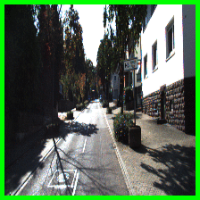
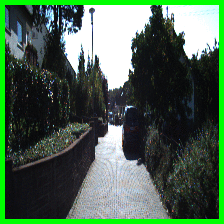
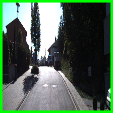

# [View Synthesis by Appearance Flow](https://arxiv.org/abs/1605.03557)
[Tinghui Zhou](https://people.eecs.berkeley.edu/~tinghuiz/), [Shubham Tulsiani](https://people.eecs.berkeley.edu/~shubhtuls/), [Weilun Sun](http://sunweilun.github.io/), [Jitendra Malik](https://people.eecs.berkeley.edu/~malik/), and [Alyosha Efros](https://people.eecs.berkeley.edu/~efros/), ECCV 2016.

## Overview

We address the problem of novel view synthesis: given an input image, synthesizing new images of the same object or scene observed from arbitrary viewpoints. We approach this as a learning task but, critically, instead of learning to synthesize pixels from scratch, we learn to copy them from the input image. Our approach exploits the observation that the visual appearance of different views of the same instance is highly correlated, and such correlation could be explicitly learned by training a convolutional neural network (CNN) to predict **appearance flows** – 2-D coordinate vectors specifying which pixels in the input view could be used to reconstruct the target view. Furthermore, the proposed framework easily generalizes to multiple input views by learning how to optimally combine single-view predictions. 

#### Single-view network architecture:


#### Multi-view network architecture:


Link to the [[Paper]](https://arxiv.org/abs/1605.03557) [[Poster]](https://people.eecs.berkeley.edu/~tinghuiz/projects/appearanceFlow/poster.pdf)

Please contact Tinghui Zhou (tinghuiz@berkeley.edu) if you have any questions.

## Citing

If you find our paper/code useful, please consider citing:

	@inproceedings{zhou2016view,
		title={View Synthesis by Appearance Flow},
		author={Zhou, Tinghui and Tulsiani, Shubham and Sun, Weilun and Malik, Jitendra and Efros, Alexei A},
		booktitle={European Conference on Computer Vision},
		year={2016}
	}

## Repo organization:

* A copy of Caffe used for our experiments is included. Specifically, it includes our CPU implementation of the bilinear differentiable image sampler (see 'include/caffe/layers/remap_layer.hpp' and 'src/caffe/layers/remap_layer.cpp').
* 'models/' contains sample prototxt files of our view synthesis models. The caffemodels can be downloaded via https://people.eecs.berkeley.edu/~tinghuiz/projects/appearanceFlow/caffemodels/[MODEL_NAME].caffemodel 
* 'data/' contains the lists of training and testing shapes in our ShapeNet experiments.
* 'ObjRenderer/' contains the rendering code we used for generating ShapeNet rendered views.

## Running the demo
We provide demo code for synthesizing novel views of ShapeNet cars from a single image. First, download the pre-trained model by
```bash
wget -N https://people.eecs.berkeley.edu/~tinghuiz/projects/appearanceFlow/caffemodels/car_single.caffemodel -O models/car_single/car_single.caffemodel
```
Then you can use the provided jupyter notebook `demo.ipynb` to run the demo.

## Sample ShapeNet Results on Single-view 3D object rotation
The input view is marked with green bounding boxes. All the other views are synthesized by our single-view object rotation network.

    

## Sample KITTI Results on 3D Scene Fly-through
The task is to synthesize a fly-through effect for the 3D scene given only two input views (marked in green and red bounding boxes). All the intermediate frames are synthesized.

   


## Acknowledgement

We thank Philipp Krähenbühl and Abhishek Kar for helpful discussions. This work was supported in part by NSF award IIS-1212798, Intel/NSF Visual and Experiential Computing award IIS-1539099, Berkeley Deep Drive,  and a Berkeley Fellowship. We gratefully acknowledge NVIDIA corporation for the donation of GPUs used for this research.
