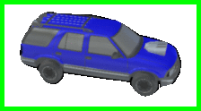
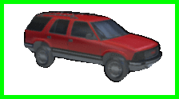
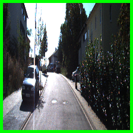
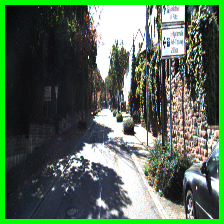
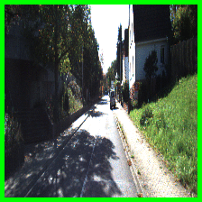

# View Synthesis by Appearance Flow
===========================

This implements the algorithm described in "View Synthesis by Appearance Flow, T. Zhou, S. Tulsiani, W. Sun, J. Malik and A. A. Efros, ECCV 2016". If you find our code useful, please consider citing:

	@inproceedings{zhou2016view,
		title={View Synthesis by Appearance Flow},
		author={Zhou, Tinghui and Tulsiani, Shubham and Sun, Weilun and Malik, Jitendra and Efros, Alexei A},
		booktitle={European Conference on Computer Vision},
		year={2016}
	}

### Abstract

We address the problem of novel view synthesis: given an input image, synthesizing new images of the same object or scene observed from arbitrary viewpoints. We approach this as a learning task but, critically, instead of learning to synthesize pixels from scratch, we learn to copy them from the input image. Our approach exploits the observation that the visual appearance of different views of the same instance is highly correlated, and such correlation could be explicitly learned by training a convolutional neural network (CNN) to predict appearance flows – 2-D coordinate vectors specifying which pixels in the input view could be used to reconstruct the target view. Furthermore, the proposed framework easily generalizes to multiple input views by learning how to optimally combine single-view predictions. We show that for both objects and scenes, our approach is able to synthesize novel views of higher perceptual quality than previous CNN-based techniques.

### Sample ShapeNet Results on Single-view 3D object rotation

### Sample KITTI Results on Virtual Scene Fly-through

